## TESTING

## TABLE OF CONTENTS

* [Validation](#validation)
    * [HTML Validation](#html-validation)
    * [CSS Validation](#css-validation)
    * [JavaScript Validation](#javascript-validation)
    * [Python Validation](#python-validation)
    * [Lighthouse Report](#lighthouse-report)
    * [Responsive and Browser Testing](#responsive-and-browser-testing)
    * [Transactional Email](#transactional-email)
    * [Testing User Stories](#testing-user-stories)
    * [Manual Testing](#manual-testing)
    * [Bugs and Error checking](#bugs-and-error-checking)
    * [Solved Bugs](#solved-bugs)
    * [Known Bugs](#known-bugs)

## Validation

### HTML Validation

The W3C Markup Validator was used to validate some of the tutorial templates similar to the Boutique Ado project. There was a warning to suggests that the type attribute specified in the script tag was unnecessary for JavaScript resources on some of the pages.
I tested all custom templates - the blog templates, the subscribe template and the stockists template. They all had no errors, except for the stockists template. I updated a closing tag missing and checked for others although the validator did not recognise my updates to the file. I checked using direct input instead and the only errors were related to the Django syntax and not the html. 

-   [W3C Markup Validator](https://jigsaw.w3.org/css-validator/#validate_by_input) - [Results](/media/htmlvalidation.png)

### CSS Validation

The W3C CSS Validator was used to validate the base.css file which showed no errors.

-   [W3C CSS Validator](https://jigsaw.w3.org/css-validator/#validate_by_input) - [Results](media/w3cssvalidation.png)

### JavaScript Validation

The JSHint validation service was used to used to validate JavaScript used for Stripe functionality in the project. There were 2 warnings related to the ES6 version of JavaScript

-   [JSHint Validator](https://jshint.com/) - [Results](media/jsvalidation.png)

### Python Validation

The Code Institute Python Linter was used to validate every page of the project to ensure there were no syntax errors in the project. I amended any errors for example: syntax and line breaks - the remaining errors are related to lines of code being too long in some files. However, I wanted to preserve clarity and readability of the code, so I left the code as it is.

-   [CI Python Linter ](https://pep8ci.herokuapp.com/) - [Results](media/pythonvalidations)

### Lighthouse Report

I used Lighthouse to audit the site to evaluate performance, accessibility, SEO and best practices - accessibility scores were slightly reduced due to heading elements not in a sequentially-descending order, and buttons could have a more accessible name for screen readers, which would be a consideration for future template development.

- 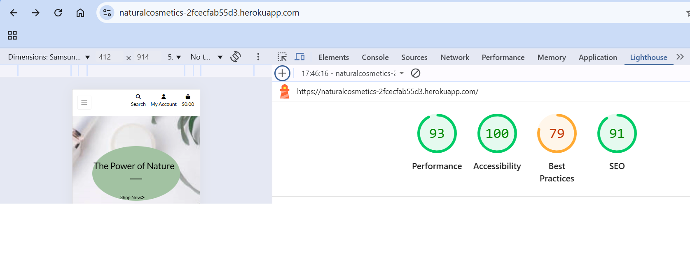
- 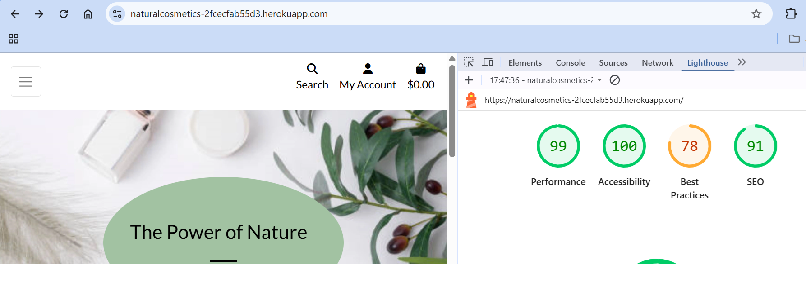

### Responsive and Browser Testing

As well as validating all html, css, js & python files, I have checked compatibilities across a selection of browsers and devices.

- 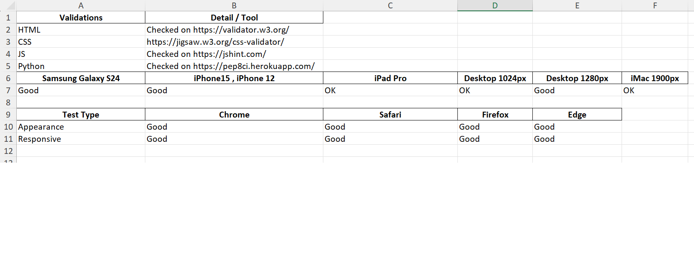

### Transactional Email

I tested to make sure users receive an email at registration to verify their account and also an email containing their order details following purchase.

- 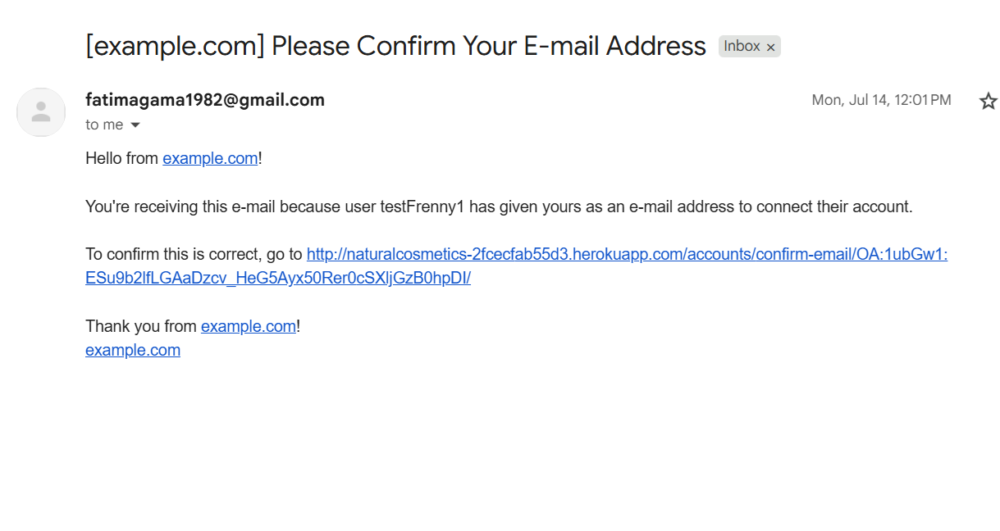
- 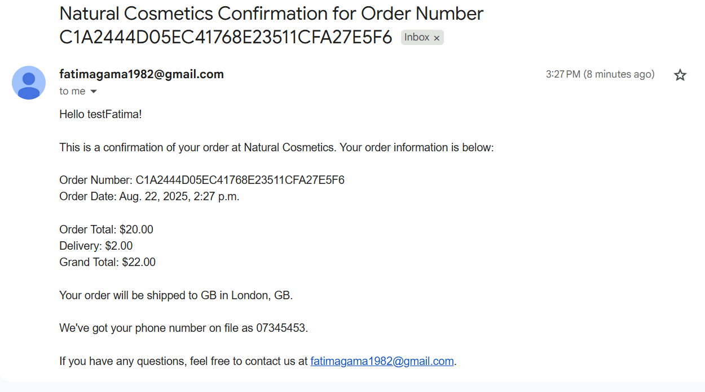

### Testing User Stories

-   #### First Time Visitor Goals

    1. As a First Time Visitor, I want to easily understand the main products sold by the cosmetics company

        1. Upon entering the site, users are automatically greeted with a clean and easily readable navigation bar to go to the page of their choice. Underneath there is a Hero Image with Text and a "Shop Now" Call to action button.
        2. The main visual impression of the brand is evident immediately with the hero image.

        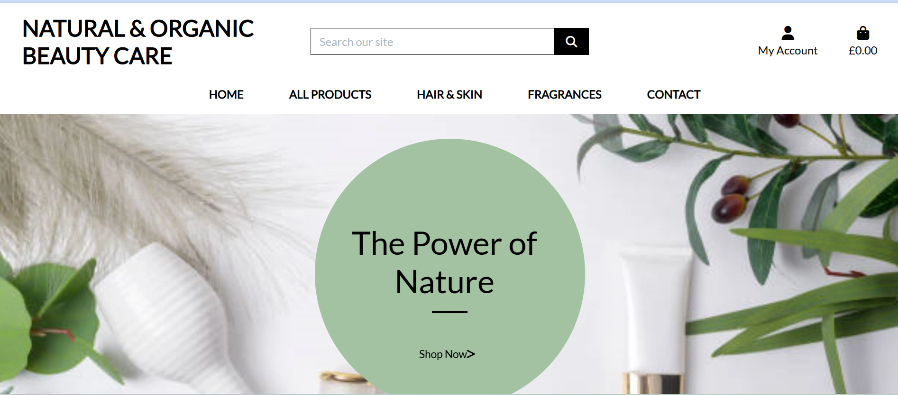

    2. As a First Time Visitor, I want to navigate easily through the product categories so I can find what I need without confusion

        1. At the top of each page there is a clean navigation bar, each link has a dropdown menu which describes what category they will end up at clearly, alternatively the left hand dropdown menu offers a selection of sort methods.
        2. Users can click on a product of interest to find out more about the product and add their chosen quantity to their basket.
        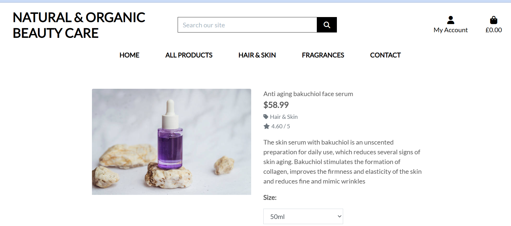
        3. There is a Keep Shopping call to action button at the bottom of each product page to return the customer to the main product page.

    3. As a First Time Visitor, I want to sign up for offers or updates
        ### Acceptance criteria:
        - Subscribe button is available
        ### Tests
        - Does subsribe button allows to send an email
        - is the confirmation messages or email sent?

        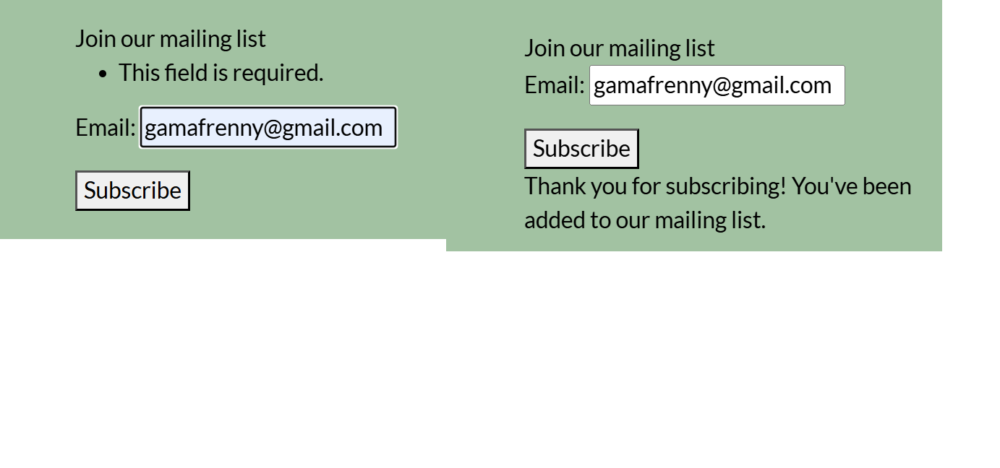

-   #### Returning Visitor Goals

    1. As a Returning Visitor, I want to explore and find new product launches or seasonal collections.

        1. Highlighted on the homepage or via newsletter signups

    2. As a Returning Visitor, I want to be able to buy products form the store and get them delivered.

        1. The individual product pages allow users to add products to their bag.
        2. A toast message will appear to inform the user they have successfully added the product quantity to the bag.
        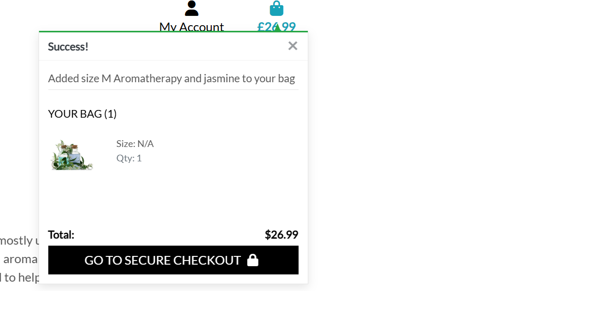
        3. Users can see products listed on the shopping bag page with a total cost information on delivery threshold and a button to click through to the checkout page to purchase.
        4. Users can create an account and buy products for delivery using card payment methods.
        5. The user receives a toast message to confirm if the purchase was successful and the user will receive a confirmation emai to their email address.

    3. As a Returning Visitor, I want to be able track orders and the history
        1. Quick access to delivery status and history
        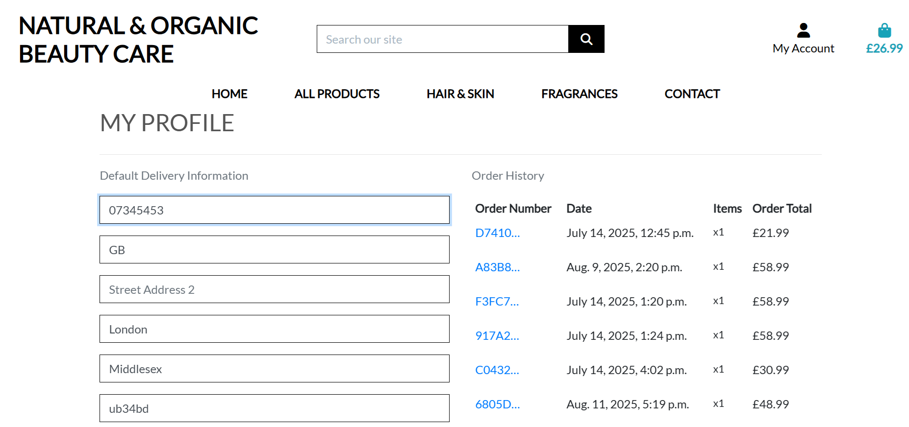

-   #### Frequent User Goals

    1. As a Frequent User, I want to be able to find products easily through search options.

        1. The user can explore the sort methods in the drop down menu on the main navigation and sort products by price rating or category. 
        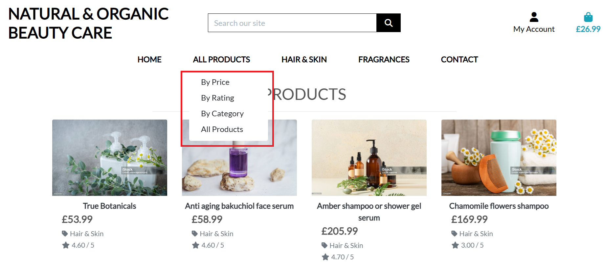
    2. As a Frequent User, I want to sign up and create my own account.

        1. Users can set up an account at any time. This would be more relevant to users who buy often and like the speed and convenience of ordering whilst logged into their account. They can also keep a record of past users and their delivery details are autosaved.

    3. As a Frequent User, I want to sign up to the Newsletter so that I am emailed information about any new products.
        1. Via the footer users can subscribe by email.
        2. The user can contact via contact form. 

-   #### Site Owner Goals

    1. As a Site Owner, I want the website to be attractive to customers and entice them to buy products easily.
        1. The home page displays a structured navigation with sotrting and filtering functionality, enabling shoppers to find products easily.
        2. Product pages display an image and a clear desription of the product which can be easily added to a basket which is displayed in a modal to the top right of the page. 

    2. As a Site Owner, I want to establish a regular customer base who return and make regular purchases.
        1. Customers can create their own account through the sign-up page and save their details. They can also see a list of previous purchases within the account layout
        2. Contact form can be used to contact
        3. Can subscribe to the newsletter via subscribe button on the footer section

### Manual Testing
| **TEST** | **TEST DETAILS** | **EXPECTED RESULTS** | **ACTUAL RESULTS** | **PASS/FAIL** | **EVIDENCE**
| :-- | :-- | :-- | :-- | :-- | :-- |
| **TOP HEADER LINKS** |  |  |  |  | [desktop](./media/testingdocument/topheaderdesktop.png), [tablet](./media/testingdocument/topheadertablet.png), [mobile](./media/testingdocument/topheadermobile.png) |
| 1 | Access URL: http://naturalcosmetics-2fcecfab55d3.herokuapp.com// |Site shows home page including Nav & Search Bar, Account, site content & footer | As Expected | Pass |
| 2 | Click Natural & Organic Beauty Care Logo | Site shows home page | As expected | Pass |
| 3 | Search bar | Error msg appears if nothing entered in search bar and produt page displays  | As Expected  | Pass |
| 4 | Search bar - product search | Return correct results whether search term appears in product name or product description  | As Expected  | Pass |
| 5 | Account login icon | Click account icon shows login/Register dropdown menu | As Expected  | Pass |
| 6 | Dropdown Register menu item | Dropdown Register menu item  | As Expected  | Pass |
| 7 | Dropdown Login menu item | Click Login menu item goes to Login page  | As Expected  | Pass |
| 8 | Bag icon | Click Bag icon takes user to bag page | As Expected  | Pass |
| **MAIN NAV LINKS** |  |  |  |  | [desktop](./media/Testingdocument/navigationdesktop.png), [tablet](./media/Testingdocument/navigationtablet.png), [mobile](./media/Testingdocument/navigationmobile.png) |
| 9 | Products menu item | Click All Products menu icon shows drop down with price/rating or All Products options | As Expected  | Pass |
| 10 | Dropdown Price menu item | Click Price dropdown menu item goes to product sorted by price | As Expected  | Pass |
| 11 | Dropdown Rating menu icon | Click Rating dropdown menu item goes to product page sorted by rating | As Expected  | Pass |
| 12 | Dropdown All Products shows menu item | Click all products dropdown goes to product page | As Expected  | Pass |
| 13 | Hair & Care menu item  | Click Hair & Care menu icon shows all the Hari and Care products | As Expected  | Pass |
| 14 | Fragrances | Click Fragrances menu item goes to product page displaying fragrances category | As Expected  | Pass |
| 15 | Contact menu item   | Click contact menu item goes to contact page | As Expected  | Pass |
| **Subscribe** |  |  |  |  | [desktop](./media/testingdocument/subscribedesktop.png), [tablet](./media/testingdocument/subscribetablet.png), [mobile](./media/testingdocument/subscribemobile.png) |
| 22 | Subscribe button | Click Subscribe button shows the email text box to enter email | As Expected  | Pass |
| 23 | Subscribe button after entering an email | Click on the subscribe button after entering an email will receive a confirmation message | As Expected  | Pass |
| **FOOTER LINKS** |  |  |  |  | [desktop](./media/testingdocument/footerlinksdesktop.png), [tablet](./media/testingdocument/footerlinksmobile.png.png), [mobile](./media/testingdocument/footerlinkstablet.png.png)  |
| 25 | Social media links | Click social media links redirects to respective page | As Expected  | Pass |
| **USER PROFILE SETUP** |  |  |  |  | [desktop](./media/testingdocument/profile-desktop.png.png), [tablet](./media/testingdocument/profile-tablet.png.png), [mobile](./media/testingdocument/profile-mobile.png.png) |
| 26 | Sign-up button | Error message appears if nothing entered in input fields or incorrect data | As Expected  | Pass |
| 27 | Sign-up button |  Alert appears showing email sent to email address for verification | As Expected  | Pass |
| 28 | Login button |  New unverified users receive alert | As Expected  | Pass |
| 29 | New users receive email to inbox |  Message appears in inbox - click message returns user to site with confirmation Toast message evident | As Expected  | Pass |
| 30 | New users receive email to inbox |  Message appears in inbox - click message returns user to site with confirmation Toast message evident | Says example.com in message | Check Error |
| 31 | Logged in Admin users can access product management page |  Click dropdown menu item - Product management evident | As Expected  | Pass |
| 31 | Logged in Admin users can access product management page |  Click dropdown menu item - Product management evident | As Expected  | Pass |
| 32 | Non-admin users cannot access product management page |  Click dropdown menu item - Product management  not evident | As Expected  | Pass |
| 33 | Admin users can add a product  in product management |  Product is added when fields completed - if no image url added, then default no-image png file displayed | As Expected  | Pass |
| 34 | CRUD functionality product management - add |  When all fields filled product can be added - of url missing, then default image is used. Product appears on Product page | As Expected  | Pass |
| 35 | CRUD functionality product management - edit |  Click edit link and fields can be successfully updated  | As Expected  | Pass |
| 36 | CRUD functionality product management - delete |  Click delete button and toast confirmation of product deletion appears. - redirect to Products page  | As Expected  | Pass |
| 37 | Profile page shows previous orders |  Click delete button and toast confirmation of product deletion appears. - redirect to Products page  | As Expected  | Pass |
| 38 | Profile page saves payment details and address fields |  Form fields are saved when checkbox clicked and after aditional logins | As Expected | Pass |
| 39 | Log out of account as admin and as ordinary user |  Click logout in dropdown under acoount icon goes to logout page | As Expected | Pass |
| 40 | Sign-out page |  Cancel link takes user to home page whilst logged in, sign out button takes user to homepage & signed out with asuccess message evident | As Expected | Pass |
| **BAG OPTIONS** |  |  |  |  | [desktop](./media/testingdocument/shopping-bag-desktop.png), [tablet](./media/testingdocument/shopping-bag-tablet.png), [mobile](./media/testingdocument/shopping-bag-mobile.png) |
| 41 | Bag page displays prices |  Individual prices, Bag total, Grand Total listed accurately | As Expected | Pass |
| 42 | Bag page displays message if total under free delivery rate |  Message evident with indicated additional spend required for free delivery | As Expected | Pass |
| 43 | Bag page displays quantity of products required |  Message evident with indicated additional spend required for free delivery | As Expected | Pass |
| 44 | Bag page has adjustable quantity options |  Users can increase or decrease product quantities - but not zero or minus quantities | As Expected | Pass |
| 45 | Bag page has adjustable quantity options |  Users can increase or decrease product quantities - but not zero or minus quantities | As Expected | Pass |
| 46 | Bag page allows product removal |  Users can remove a product from the bag | As Expected | Pass |
| 47 | Bag page shows product options |  Product options displayed on relevant products | As Expected | Pass |
| 48 | Secure checkout button |  Secure checkout button goes to checkout page | As Expected | Pass |
| 49 | Keep shopping button |  Keep shopping button goes to products page | As Expected | Pass |
| 50 | View bag page without products added |  Keep shopping button goes to products page | As Expected | Pass |
| **CHECKOUT & PAYMENT** |  |  |  |  | [desktop](./media/testingdocument/checkout-desktop.png), [tablet](./media/testingdocument/checkout-tablet.png), [mobile](./media/testingdocument/checkout-mobile.png.png) |
| 51 | Customer detail form fields cannot be empty when ordering |  Popup appears reminding user that form fields must be filled before submitting order | As Expected | Pass |
| 52 | Adjust bag link works|  User is taken to bag page | As Expected | Pass |
| 53 | Warning appears if card expired|  Alert appears indicating expiry date is in the past and order cannot be submitted | As Expected | Pass |
| 54 | Successful online payment prompts feedback to user|  Toast alerts usert that payment has been successful and provides order number | As Expected | Pass |
| 55 | Completed order can be viewed in profile section|  Order information is listed on Checkout Success page and information provided to user that a confirmation email has been sent to their email account | As Expected | Pass |
| 56 | Confirmation email works correctly| Confirmation email has been received and contains correct information | As Expected | Pass |
| 57 | Order history is correct| The order can be seen in Order History on user profile page | As Expected | Pass |
| 58 | Test link to order detail on Profile Page| Link takes user to order detail on Order History page in User Profile | As Expected | Pass |

### Known Bugs
- When a user clicks on Suscribe button, user is not taken back to the footer to enter an email. User manually need to scroll to the bottom

- After suscribing email is not cleared on refreshing the browser